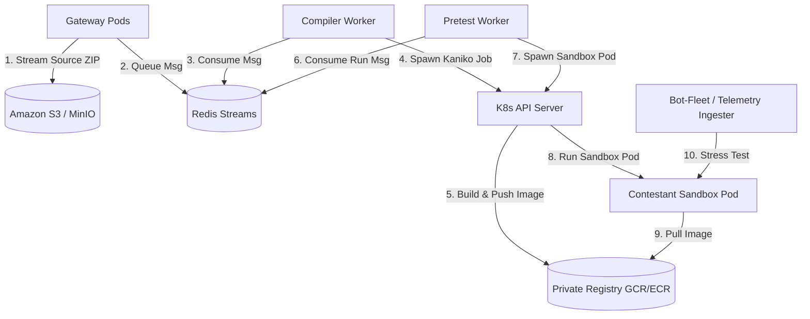

# Production Kubernetes Integration Blueprint

This document details the system design, migration checklist, and security policies for deploying the **IICPC-BenchGrid** platform to a multi-node production-grade Kubernetes cluster (e.g., GKE, EKS, AKS).

---

## 1. Architectural Pivot Overview

The local development setup uses a hybrid Kubernetes/Docker architecture:
* The control-plane/gateways run inside Kind.
* Sandboxes are compiled and run via direct Docker daemon commands using `/var/run/docker.sock` (Docker-out-of-Docker / DooD).
* Storage is shared via a local `ReadWriteOnce` PVC.

For a secure, resilient, and horizontally scalable **production environment**, we must transition to a fully cloud-native, dockerless design:



---

## 2. Key Pivot 1: Kubernetes client-go Integration

Instead of invoking direct Docker CLI commands, the compiler and pretest workers must orchestrate jobs and pods natively through the **Kubernetes Go Client API (`client-go`)**.

### Pod Spec Template for Sandbox Executions
When a pretest starts, the pretest worker creates a native Pod in an isolated namespace (`iicpc-sandboxes`).

```yaml
apiVersion: v1
kind: Pod
metadata:
  name: contestant-sandbox-12345
  namespace: iicpc-sandboxes
  labels:
    app: contestant-sandbox
    submission-id: "12345"
spec:
  restartPolicy: Never
  containers:
  - name: sandbox
    image: <registry>/contestant-12345:latest
    imagePullPolicy: IfNotPresent
    ports:
    - containerPort: 8000
    resources:
      limits:
        cpu: "2"
        memory: "512Mi"
      requests:
        cpu: "1"
        memory: "256Mi"
    securityContext:
      allowPrivilegeEscalation: false
      runAsNonRoot: true
      runAsUser: 10001
      capabilities:
        drop:
        - ALL
```

### Mitigating API Server Churn & Scheduling Latency

#### Control Plane Protection
High-frequency pod creation can trigger etcd bottlenecks.
* **Batching**: Queue sandbox spawning in workers to maintain a maximum of $N$ concurrent provisioning tasks.
* **Dedicated API Client Cache**: Use informers to check pod status rather than repeatedly calling `Get` or `List` endpoints.

#### Scheduling Latency Optimization
* **Dedicated Node Pool**: Provision a dedicated, warm Kubernetes node pool specifically for contestant sandboxes.
* **Pre-warmed Images**: Run a daemonset on the node pool to pre-pull large baseline runtime images (e.g., standard golang, rust, C++ libraries) so node pulls are near-instant.

---

## 3. Key Pivot 2: Decoupled Storage Architecture

Shared PVCs using `ReadWriteOnce` fail when pods are scheduled across multiple nodes. In production, we eliminate shared filesystem storage entirely in favor of an **Object Storage (S3/MinIO)** model.

```
[Contestant Submission] 
       │
       ▼
 ┌───────────┐         ZIP Upload
 │  Gateway  │ ───────────────────────────┐
 └───────────┘                            │
                                          ▼
 ┌───────────┐    Download ZIP      ┌───────────┐
 │ Compiler  │ <─────────────────── │ S3 Bucket │
 └───────────┘                      └───────────┘
       │
       ▼ Build Container Image
 ┌───────────┐
 │ Registry  │
 └───────────┘
```

1. **Submission**: The `Gateway` receives the code zip file and immediately uploads it to an S3 bucket (`s3://iicpc-submissions/`).
2. **Metadata**: The database only stores the object path key.
3. **Compilation**: The `compiler` worker queries the S3 path, pulls the ZIP file, compiles it inside a temporary ephemeral directory, and uploads the built container image to a secure registry.
4. **Execution**: The `pretest` worker deploys the container image directly to K8s from the registry, requiring **zero** shared local disks.

---

## 4. Key Pivot 3: Secure Dockerless Image Building with Kaniko

Without mounting `/var/run/docker.sock`, workers cannot run `docker build`. We swap programmatic Docker builds with **Kaniko**, an open-source tool for building container images inside standard Kubernetes containers without root privileges.

### How it Works
1. When a submission is queued, the `compiler` worker generates a Kaniko Job spec.
2. Kaniko mounts the S3 credentials and the code ZIP as context.
3. Kaniko parses the contestant's Dockerfile, builds the layers in user space, and pushes the final image to the private registry.

### Kaniko Job Manifest Example
```yaml
apiVersion: batch/v1
kind: Job
metadata:
  name: kaniko-build-12345
  namespace: default
spec:
  template:
    spec:
      containers:
      - name: kaniko
        image: gcr.io/kaniko-project/executor:latest
        args:
        - "--context=s3://iicpc-submissions/12345/submission.zip"
        - "--dockerfile=Dockerfile"
        - "--destination=<registry>/contestant-12345:latest"
        env:
        - name: AWS_ACCESS_KEY_ID
          valueFrom:
            secretKeyRef:
              name: s3-credentials
              key: access-key
        - name: AWS_SECRET_ACCESS_KEY
          valueFrom:
            secretKeyRef:
              name: s3-credentials
              key: secret-key
      restartPolicy: Never
  backoffLimit: 1
```

---

## 5. Security & Network Isolation

### Contestant Network Policy
With sandboxes running as native Kubernetes pods inside the `iicpc-sandboxes` namespace, we can enforce strict traffic rules at the CNI layer:

```yaml
apiVersion: networking.k8s.io/v1
kind: NetworkPolicy
metadata:
  name: strict-sandbox-policy
  namespace: iicpc-sandboxes
spec:
  podSelector:
    matchLabels:
      app: contestant-sandbox
  policyTypes:
  - Ingress
  - Egress
  ingress:
  # Allow inbound HTTP/WebSocket traffic only from the bot-fleet pod in the default namespace
  - from:
    - namespaceSelector:
        matchLabels:
          kubernetes.io/metadata.name: default
      podSelector:
        matchLabels:
          app: bot-fleet
    ports:
    - protocol: TCP
      port: 8000
  # Block all egress traffic (prevent exfiltration of market data, attacks on default metadata service)
  egress: []
```

---

## 6. Deployment Migration Steps Checklist

- [ ] **Infrastructure Provisioning**:
  - Provision a managed Kubernetes cluster (GKE/EKS).
  - Create a private container registry (GCR/ECR).
  - Setup AWS S3 bucket and IAM roles (ServiceAccounts with IRSA).
- [ ] **Codebase Refactor**:
  - Implement a `KubernetesClient` using `client-go` inside `services/pretest/main.go` to replace the `moby/client` Docker client.
  - Implement the Kaniko job manager inside `services/compiler/worker.go`.
- [ ] **Secret Configuration**:
  - Define Kubernetes secrets for database passwords, registry credentials, and S3 credentials.
  - Remove all plain-text passwords and hardcoded endpoints from config files.
