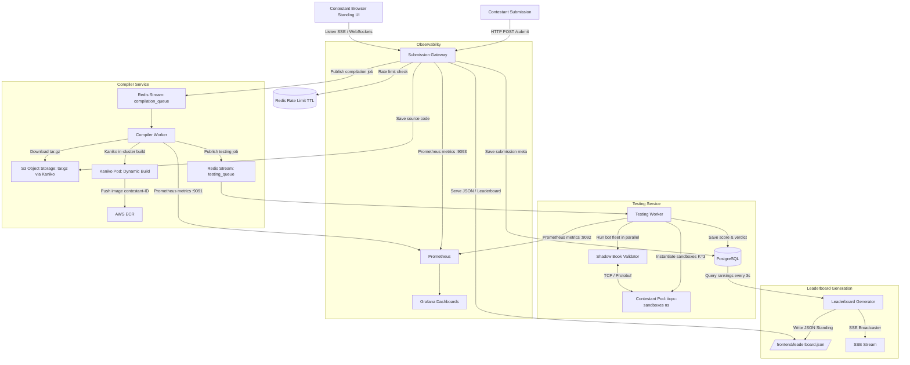
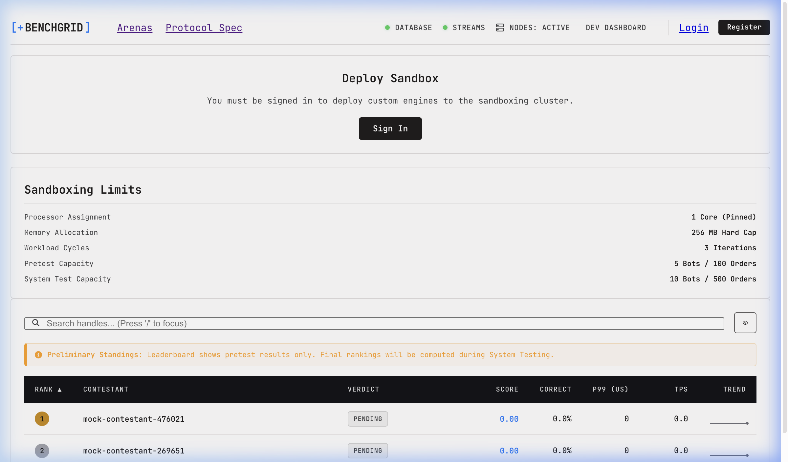
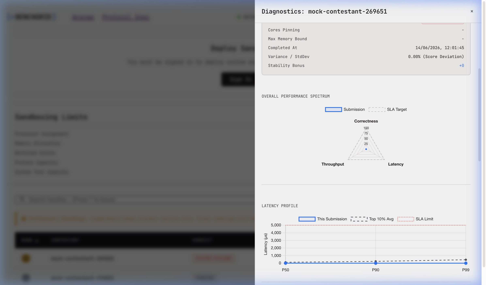
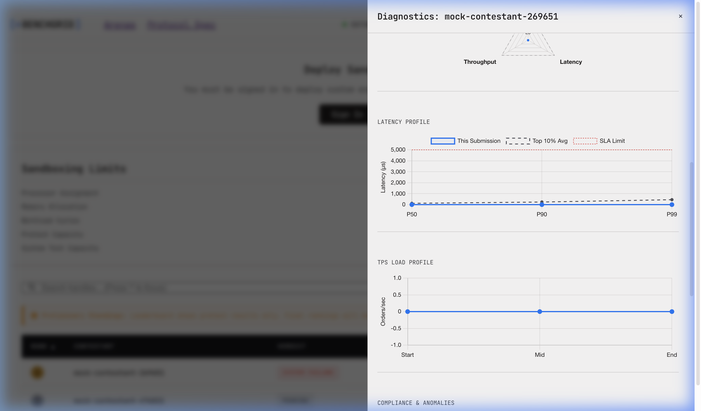
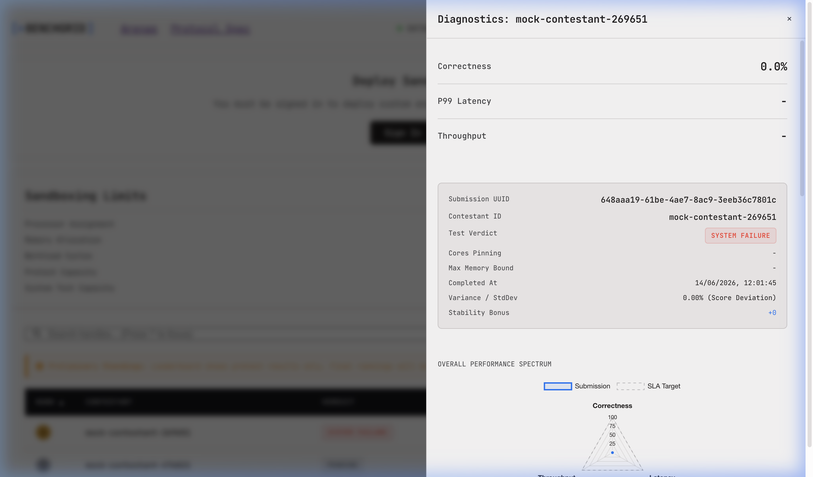
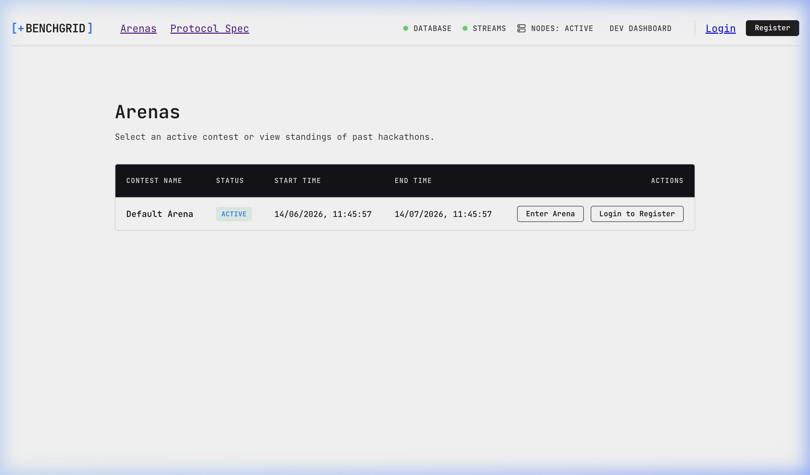

# IICPC-2026-BenchGrid: Distributed Benchmarking and Hosting Platform

An event-driven, microservice-based distributed evaluation platform designed to compile, isolate, benchmark, and score contestant-submitted matching engines under high concurrency. Built to scale to 100K concurrent viewers, 5K submitters, and 50K leaderboard contestants.

**Key sub-systems:** Submission Gateway (rate-limited REST + SSE) → Kaniko in-cluster image build (no privileged pods) → K8s Sandbox Pod lifecycle in `iicpc-sandboxes` namespace → 500-goroutine MMPP bot fleet (3 trial runs) → Red-Black-tree shadow book validator → composite scoring formula → real-time SSE leaderboard + contestant diagnostic dashboard.

**Design documents:** [`ARCHITECTURE_BLUEPRINT.md`](ARCHITECTURE_BLUEPRINT.md) · [`backend_system_design.md`](backend_system_design.md) · [`bot_fleet_shadow_validator_design.md`](bot_fleet_shadow_validator_design.md) · [`scoring_system_design.md`](scoring_system_design.md) · [`K8S_DESIGN.md`](K8S_DESIGN.md) · [`OBSERVABILITY_DESIGN.md`](OBSERVABILITY_DESIGN.md)

---

## 🔗 Live Deployment (Production)

| Service | URL | Credentials |
|---|---|---|
| **Contestant Arena** | [`http://k8s-default-submissi-f6910ca3a8-2090885288.us-east-1.elb.amazonaws.com/`](http://k8s-default-submissi-f6910ca3a8-2090885288.us-east-1.elb.amazonaws.com/) | - |
| **Dev Console / Dashboard** | [`http://k8s-default-submissi-f6910ca3a8-2090885288.us-east-1.elb.amazonaws.com/dashboard`](http://k8s-default-submissi-f6910ca3a8-2090885288.us-east-1.elb.amazonaws.com/dashboard) | `admin` / `Admin123!` |
| **Grafana Observability** | [`http://k8s-monitori-grafanai-267ec7424a-1315873619.us-east-1.elb.amazonaws.com`](http://k8s-monitori-grafanai-267ec7424a-1315873619.us-east-1.elb.amazonaws.com) | `admin` / `iicpc-admin-2026` |
| **API Base URL** | [`http://k8s-default-submissi-f6910ca3a8-2090885288.us-east-1.elb.amazonaws.com/api/v1/`](http://k8s-default-submissi-f6910ca3a8-2090885288.us-east-1.elb.amazonaws.com/api/v1/) | — |

### Admin Credentials
| Role | Username | Email | Password |
|---|---|---|---|
| Admin | `admin` | `admin@iicpc.dev` | `Admin123!` |
| Grafana Admin | `admin` | — | `iicpc-admin-2026` |

---

## 1. System Architecture

The platform uses a completely decoupled, event-driven, and highly resilient microservices pipeline connected via **Redis Streams**, backed by **PostgreSQL**, **S3-compatible Object Storage (MinIO / AWS S3)**, and **Apache Kafka (Redpanda)**.



### Subsystems and Decompositions
* **Submission Gateway** (`services/gateway/`): Stateless Fiber web server handling submission uploads, rate limiting, and dashboard UI telemetry. Intercepts requests for `leaderboard.json` and reads standings from the configured volume path.
* **Compiler Service** (`services/compiler/`): Event loop polling `compilation_queue` stream, executing isolated Kaniko in-cluster builds from user-submitted `tar.gz` archives under strict timeouts. Pushes built images to AWS ECR.
* **Testing Service** (`services/testing/`): Ephemeral sandbox runner instantiating contestant Kubernetes pods in the `iicpc-sandboxes` namespace (on dedicated `sandbox-executions` node group) in parallel ($K=3$ runs), executing trade-matching bots via raw TCP using little-endian length-prefixed Protobuf messages, and verifying correctness in real-time.
* **Developer Diagnostics Console**: Accessible directly at `/dashboard` to inspect live container instances, view active queue depths, run automated mock pretest/systest submissions, and inspect contestant code/telemetry drawers.



---

## 2. Secure Sandboxing & Network Model

### Local / Kind Mode (Docker)
```
       +-----------------------------------------------+
       |                   Host OS                     |
       |  +-----------------------------------------+  |
       |  |          gVisor (runsc) Sandbox         |  |
       |  |  +-----------------------------------+  |  |
       |  |  |       Contestant Container        |  |  |
       |  |  |  [cgroups: 1 CPU, 256MB RAM]      |  |  |
       |  |  |  [NetworkPolicy: Egress Deny]     |  |  |
       |  |  |  [seccomp: blocked fork/vfork]    |  |  |
       |  |  |  [Protocol: TCP / Protobuf]       |  |  |
       |  |  |  Bind: Port 8000                  |  |  |
       |  |  +-----------------------------------+  |  |
       |  +-------------------|---------------------+  |
       |                      | (Dynamic Host Port Mapped)
       |                      v
       |           tcp://127.0.0.1:{random}
       +-----------------------------------------------+
```

### Production / EKS Mode (Kubernetes Pods)
Contestant sandboxes run as isolated Kubernetes pods in the dedicated `iicpc-sandboxes` namespace on the `sandbox-executions` node group (tainted `sandbox-only=true:NoSchedule`):

```
+--------------------------------------------------------------+
|  EKS Node Group: sandbox-executions (tainted)               |
|                                                              |
|  +--------------------------------------------------------+  |
|  |  Pod: contestant-{submissionID}-run-{N}               |  |
|  |  Namespace: iicpc-sandboxes                           |  |
|  |  [runAsNonRoot: true, runAsUser: 10001]               |  |
|  |  [AllowPrivilegeEscalation: false]                    |  |
|  |  [Capabilities: DROP ALL]                             |  |
|  |  [CPU: 1 req / 2 limit, Memory: 256Mi req / 512Mi]   |  |
|  |  Port: 8000                                           |  |
|  +--------------------------------------------------------+  |
+--------------------------------------------------------------+
```

Security properties:
1. **Non-root execution**: `runAsUser: 10001`, `runAsNonRoot: true`
2. **Capability drop**: `DROP ALL` Linux capabilities
3. **No privilege escalation**: `AllowPrivilegeEscalation: false`
4. **Dedicated node group**: Tainted node group prevents system pods from co-scheduling
5. **Pod cleanup**: Force-deleted with `gracePeriodSeconds=0` after each run; defensive delete-before-create prevents "already exists" conflicts between pretest and systest phases

---

## 3. Infrastructure Overview (AWS EKS Production)

### Architecture
| Component | Type | Details |
|---|---|---|
| **EKS Cluster** | Kubernetes 1.35 | `iicpc-benchgrid`, `us-east-1` |
| **Core Node Group** | `t3.medium` ×2–8 | `core-workloads`, runs gateway/workers/monitoring |
| **Sandbox Node Group** | `t3.medium` ×1–5 | `sandbox-executions`, tainted, contestant pods only |
| **PostgreSQL** | AWS RDS (private subnet) | `iicpc-benchgrid-db.cepaasao0lur.us-east-1.rds.amazonaws.com:5432` |
| **Redis** | AWS ElastiCache | `iicpc-benchgrid-cache.*.use1.cache.amazonaws.com:6379` |
| **S3 Storage** | AWS S3 | Bucket: `iicpc-benchgrid-submissions-bucket` |
| **Container Registry** | AWS ECR | `445711599575.dkr.ecr.us-east-1.amazonaws.com` |
| **Load Balancer** | AWS ALB (Ingress) | Via `aws-load-balancer-controller` |

### Autoscaling
| Component | Type | Min | Max | Trigger |
|---|---|---|---|---|
| `compilation-worker` | HPA (CPU) | 1 | 20 | 60% CPU avg |
| `testing-worker` | HPA (CPU) | 1 | 20 | 80% CPU avg |
| `core-workloads` ASG | Cluster Autoscaler | 1 | 8 | Pending pods |
| `sandbox-executions` ASG | Cluster Autoscaler | 1 | 5 | Pending pods |

HPA scale-down stabilization: **30 seconds** (fast cooldown after submission bursts).

### Load Configuration
| Test Type | Bots | Orders/Bot | Total Orders |
|---|---|---|---|
| **Pretest** | 50 | 200 | 10,000 |
| **System Test** | 500 | 2,000 | **1,000,000** |

Configurable via `SYSTEST_NUM_BOTS` / `SYSTEST_ORDERS_PER_BOT` env vars in the `iicpc-config` ConfigMap.

---

## 4. Setup & Deployment Guide

### Prerequisites

Ensure the following tools are installed:

```bash
# macOS (Homebrew)
brew install go docker kubectl helm kind terraform jq

# Verify versions
go version          # 1.22+
docker --version
kubectl version --client
helm version        # 3.12+
kind version        # 0.20+
terraform version   # 1.5+
```

---

### Option A: Local Development Mode (Standalone Go + Docker)

Fastest iteration loop — stateful services in Docker, Go binaries run on host.

```bash
# 1. Start databases and infrastructure
docker compose up -d postgres redis minio prometheus grafana init-db

# Wait ~10s for DB migrations to complete
sleep 10

# 2. Start all microservices
./scripts/start_dev_services.sh

# 3. Smoke test (in a new terminal)
./scripts/local_smoke.sh go_optimized

# 4. Full E2E suite
./scripts/run_e2e_tests.sh
```

**Access:**
| Service | URL | Credentials |
|---|---|---|
| Dev Console / Dashboard | http://localhost:3000/dashboard | `admin` / `Admin123!` |
| API | http://localhost:3000/api/v1/ | — |
| MinIO Console | http://localhost:9001 | `minioadmin` / `minioadmin` |
| Prometheus | http://localhost:9090 | — |
| Grafana | http://localhost:3001 | `admin` / `admin` |

---

### Option B: Local Kubernetes Mode (Kind Cluster)

Runs everything inside a local multi-node Kind cluster — mirrors production topology.

#### Step 1 — Install prerequisites
```bash
# Install Kind if not already installed
brew install kind

# Verify Docker is running
docker info
```

#### Step 2 — Create the Kind cluster
```bash
kind create cluster --name iicpc-cluster --config k8s/kind-config.yaml
```

#### Step 3 — Build images and deploy to cluster
```bash
# One command: compiles Go binaries, builds Docker images,
# loads them into Kind, and applies all K8s manifests
./scripts/deploy_k8s.sh
```

> This script automatically detects the Kind context and loads images directly — no registry push needed.

#### Step 4 — Apply the local configmap
```bash
kubectl apply -f k8s/configmap.yaml
```

#### Step 5 — Start host-level MinIO (S3 storage)
```bash
docker compose up -d minio
```

#### Step 6 — Establish port-forwards to localhost

Open a new terminal and run all port-forwards:

```bash
# Kill any stale port-forwards first
pkill -f "kubectl port-forward" 2>/dev/null || true

# Gateway & Frontend (localhost:3002)
kubectl port-forward svc/submission-gateway 3002:3000 &

# PostgreSQL (localhost:5433)
kubectl port-forward svc/postgres 5433:5432 &

# Redis (localhost:6380)
kubectl port-forward svc/redis 6380:6379 &

# Prometheus metrics scrape ports
kubectl port-forward deployment/submission-gateway 9093:9093 &
kubectl port-forward deployment/compilation-worker 9091:9091 &
kubectl port-forward deployment/testing-worker    9092:9092 &
```

#### Step 7 — Verify deployment
```bash
# All pods should be Running
kubectl get pods -A

# Check HPA is registered
kubectl get hpa

# Run verification script
python3 verify_k8s.py
```

**Access (Kind mode):**
| Service | URL | Credentials |
|---|---|---|
| Dev Console / Dashboard | http://localhost:3002/dashboard | `admin` / `Admin123!` |
| API | http://localhost:3002/api/v1/ | — |
| Grafana | http://localhost:3001 | `admin` / `admin` |
| Prometheus | http://localhost:9090 | — |
| MinIO Console | http://localhost:9001 | `minioadmin` / `minioadmin` |



#### Rebuild a single service (Kind)
```bash
SERVICE=gateway  # or: compiler, testing

# Recompile
CGO_ENABLED=0 GOOS=linux go build -ldflags="-w -s" -o bin/$SERVICE ./services/$SERVICE

# Rebuild image
docker build -f Dockerfile.services --build-arg SERVICE=$SERVICE -t iicpc-$SERVICE:latest .

# Load into Kind
kind load docker-image iicpc-$SERVICE:latest --name iicpc-cluster

# Rolling restart
kubectl rollout restart deployment/submission-gateway  # adjust name
kubectl rollout status  deployment/submission-gateway --timeout=60s
```

---

### Option C: AWS EKS Production Deployment

Full cloud deployment on Amazon EKS with Terraform-managed infrastructure.

#### Prerequisites — AWS Authentication
```bash
# Configure AWS CLI (region: us-east-1)
aws configure

# Authenticate Docker to ECR
aws ecr get-login-password --region us-east-1 | \
  docker login --username AWS --password-stdin \
  445711599575.dkr.ecr.us-east-1.amazonaws.com

# Connect kubectl to the EKS cluster
aws eks update-kubeconfig --name iicpc-benchgrid --region us-east-1

# Verify connection
kubectl cluster-info
kubectl get nodes
```

#### Step 1 — Provision Infrastructure (Terraform)
```bash
cd terraform
terraform init
terraform plan    # review the plan
terraform apply   # provisions VPC, EKS, RDS, ElastiCache, ECR, IAM
cd ..
```

#### Step 2 — Bootstrap RBAC & Namespaces
```bash
kubectl apply -f build_k8s/eks-rbac.yaml
```

#### Step 3 — Install Helm dependencies
```bash
# AWS Load Balancer Controller (routes ALB ingress)
helm repo add eks https://aws.github.io/eks-charts
helm repo update
helm upgrade --install aws-load-balancer-controller eks/aws-load-balancer-controller \
  -n kube-system \
  --set clusterName=iicpc-benchgrid

# Metrics Server (required for HPA)
kubectl apply -f https://github.com/kubernetes-sigs/metrics-server/releases/latest/download/components.yaml
kubectl patch deployment metrics-server -n kube-system --type='json' \
  -p='[{"op":"add","path":"/spec/template/spec/containers/0/args/-","value":"--kubelet-insecure-tls"}]'
```

#### Step 4 — Install Prometheus + Grafana
```bash
# One-command monitoring stack deploy
./scripts/deploy_monitoring.sh
```
> Installs `kube-prometheus-stack` with IICPC ServiceMonitors, Grafana ALB ingress, and persistent EBS storage.

#### Step 5 — Build & Push Service Images to ECR
```bash
# Full build + push (all 3 services)
REGISTRY="445711599575.dkr.ecr.us-east-1.amazonaws.com"

for SERVICE in gateway compiler testing; do
  echo "=== Building $SERVICE ==="
  CGO_ENABLED=0 GOOS=linux GOARCH=amd64 go build -ldflags="-w -s" \
    -o bin/$SERVICE ./services/$SERVICE
  docker buildx build --platform linux/amd64 -f Dockerfile.services \
    --build-arg SERVICE=$SERVICE \
    -t "${REGISTRY}/iicpc-${SERVICE}:latest" --push .
done
```

#### Step 6 — Deploy to EKS
```bash
# Automated full-platform deploy (reads Terraform outputs automatically)
./scripts/deploy_aws.sh
```

> **What `deploy_aws.sh` does:**
> 1. Reads live Terraform outputs (RDS endpoint, Redis endpoint, ECR URL, IAM roles)
> 2. Patches the live ConfigMap with actual values
> 3. Applies all K8s manifests (`k8s/`)
> 4. Deploys HPAs and Cluster Autoscaler
> 5. Runs database migrations via a one-off Job
> 6. Verifies pod readiness

#### Step 7 — Manual Apply (if needed)
```bash
# Apply all manifests individually
kubectl apply -f k8s/eks-configmap.yaml
kubectl apply -f k8s/gateway.yaml
kubectl apply -f k8s/compiler.yaml
kubectl apply -f k8s/testing.yaml
kubectl apply -f k8s/postgres.yaml      # if using in-cluster DB
kubectl apply -f k8s/redis.yaml
kubectl apply -f k8s/redpanda.yaml
kubectl apply -f k8s/leaderboard.yaml
kubectl apply -f k8s/volume.yaml
kubectl apply -f k8s/hpa/compiler-hpa.yaml
kubectl apply -f k8s/hpa/testing-hpa.yaml
kubectl apply -f k8s/cluster-autoscaler.yaml
kubectl apply -f k8s/sandbox-networkpolicy.yaml
```

#### Step 8 — Verify Deployment
```bash
# All pods healthy
kubectl get pods -A

# HPA reading metrics
kubectl get hpa

# Ingress addresses (ALB URLs)
kubectl get ingress -A

# Cluster Autoscaler
kubectl logs -n kube-system -l app=cluster-autoscaler --tail=20

# Check service endpoints
kubectl get svc
```

#### Rebuild & Redeploy a Single Service (EKS)
```bash
REGISTRY="445711599575.dkr.ecr.us-east-1.amazonaws.com"
SERVICE="gateway"   # or: compiler, testing

# 1. Build binary
CGO_ENABLED=0 GOOS=linux GOARCH=amd64 go build -ldflags="-w -s" \
  -o bin/$SERVICE ./services/$SERVICE

# 2. Build & push to ECR
docker buildx build --platform linux/amd64 -f Dockerfile.services \
  --build-arg SERVICE=$SERVICE \
  -t "${REGISTRY}/iicpc-${SERVICE}:latest" --push .

# 3. Rolling restart
kubectl rollout restart deployment/submission-gateway  # adjust name
kubectl rollout status  deployment/submission-gateway --timeout=120s
```

---

## 5. Evaluation, Scoring & Verdict System

> Full details: [`scoring_system_design.md`](scoring_system_design.md) · [`scoring_system_explanation.md`](scoring_system_explanation.md)

Every submission runs **K = 3 independent trials** with different random seeds to filter out host noise. Metrics are averaged across trials before scoring.

### Scoring Formula

Three sub-scores, each 0–100:

| Sub-score | Formula | Perfect threshold | Zero threshold |
|---|---|---|---|
| **Correctness** `C` | % orders matching price-time priority | 100% | any violation |
| **Latency** `L` | `100 × (1 − (P99 − 500) / 4500)` | P99 ≤ 500 µs | P99 ≥ 5 000 µs |
| **Throughput** `T` | `(1 − failRate) × 100` | 0 failed orders | — |

**Composite score** (weighted):
```
Composite = 0.50 × C + 0.30 × L + 0.20 × T
```

**Stability bonus**: if trial-to-trial score StdDev < 2.0 %, `+5.0` bonus points are added.

### Verdict Gates (evaluated in order)

| Priority | Verdict | Condition |
|---|---|---|
| 1 | `Logic Violation` | Correctness < 100% |
| 2 | `Tail Latency Exceeded` | avg P99 > 5 000 µs |
| 3 | `Throughput Degradation` | fail rate > 10% OR TPS drop > 30% from start to end |
| 4 | `Accepted` | all gates pass |

### Engine Archetypes (auto-classified)

| Archetype | Condition |
|---|---|
| `Latency-Optimized` | L ≥ 80, T ≥ 60 |
| `Accuracy-Optimized` | C = 100, L < 60 |
| `Balanced` | C = 100, L ≥ 60, T ≥ 70 |
| `Low-Throughput` | T < 60 |

---

## 6. Bot Fleet & Shadow Validator

> Full details: [`bot_fleet_shadow_validator_design.md`](bot_fleet_shadow_validator_design.md)

The bot fleet and shadow validator run **in-process** inside the Testing Worker — no separate containers, no scheduling jitter.

### MMPP Bot Strategies (3 regimes)

| Regime | Arrival rate | Bot mix | Purpose |
|---|---|---|---|
| **Calm** | λ = 100 ord/s | 60% Market Maker, 30% Momentum, 10% Noise | Warm-up, baseline latency |
| **Burst** | λ = 10 000 ord/s | 40% Market Maker, 40% Momentum, 20% Noise | Spike resilience |
| **Panic** | λ = 100 000 ord/s | 20% Market Maker, 60% Momentum, 20% Noise | Peak TPS ceiling |

**Pre-test**: 50 bots × 200 orders = 10 000 total orders (quick sanity gate)  
**System test**: 500 bots × 2 000 orders = **1 000 000 total orders**

### Shadow Validator

A **Red-Black tree order book** runs alongside the bot fleet, independently replaying every order sent and constructing the expected fill sequence. It then diffs against the contestant's actual execution reports:

- **Priority Violation**: contestant filled a lower-priority order before a higher-priority one
- **Phantom Fill**: contestant reported a fill for an order it never accepted
- **Trade Discrepancy**: bot sent an order that received no response (counted as `orders_failed`)

Any non-zero count in these three categories reduces the Correctness score.

### Wire Protocol

Default: **little-endian length-prefixed Protobuf over raw TCP** on port 8000. The engine also supports `WS`, `REST`, and `FIX` adapters, auto-detected via the `ENGINE_PROTOCOL` environment variable inside the sandbox container.

---

## 7. Kubernetes Architecture

> Full deep-dive: [`K8S_DESIGN.md`](K8S_DESIGN.md)

### Cluster Environments

| Mode | Cluster | Image delivery | Storage | CNI |
|---|---|---|---|---|
| Local dev | Kind | `kind load docker-image` | MinIO (host) | Calico (auto-installed) |
| Production | AWS EKS | ECR via IRSA | S3 + RDS + ElastiCache | VPC CNI |

### Namespace Isolation

```
default ns          →  gateway (×2), compiler, testing, redis, postgres, redpanda
iicpc-sandboxes ns  →  contestant-{id} pods (created dynamically per evaluation)
```

The `iicpc-sandboxes` namespace enforces `NetworkPolicy`: **zero egress** + ingress only from `default` ns on TCP :8000. Sandbox pods are pinned to the `sandbox-executions` nodegroup via NodeSelector + `sandbox-only=true:NoSchedule` taint.

### Kaniko (Daemonless Image Build)

In production the compiler worker schedules a `batch/v1 Job` running `gcr.io/kaniko-project/executor` — no privileged pods, no Docker daemon. Kaniko reads the contestant ZIP from S3, builds the OCI image, and pushes to ECR using IRSA credentials. The job has `BackoffLimit: 0` and a 5-minute `ActiveDeadlineSeconds` hard limit.

### Per-Service IRSA (Least-Privilege IAM)

| ServiceAccount | IAM permissions |
|---|---|
| `iicpc-gateway` | S3 PutObject / GetObject |
| `iicpc-compiler` / `kaniko-sa` | S3 GetObject + ECR PushImage |
| `iicpc-testing` | ECR PullImage + K8s pod CRUD in `iicpc-sandboxes` |

### HPA & Autoscaling

| Deployment | Min→Max | CPU trigger | Strategy |
|---|---|---|---|
| `compilation-worker` | 1→20 | 60% | `Recreate` (avoids dual-pod CPU spike) |
| `testing-worker` | 1→20 | 80% | `Recreate` (prevents split-fleet evaluation) |
| Node groups (CA) | 1→8 / 1→5 | Pending pods | `least-waste` expander, 2 min scale-down |

---

## 8. Observability & Monitoring

> Full deep-dive: [`OBSERVABILITY_DESIGN.md`](OBSERVABILITY_DESIGN.md)

Two non-overlapping dashboards serve two audiences:

### Grafana Admin Dashboard (operators)
**Live URL:** [`http://k8s-monitori-grafanai-267ec7424a-1315873619.us-east-1.elb.amazonaws.com`](http://k8s-monitori-grafanai-267ec7424a-1315873619.us-east-1.elb.amazonaws.com) · Scrape interval: 2 s





| Panel | Query | What it tells you |
|---|---|---|
| Total Submissions | `sum(iicpc_submissions_total)` | Cumulative volume; flat = no activity |
| Active Jobs | `sum(iicpc_worker_active_jobs)` | 🟢 <5 / 🟠 ≥5 / 🔴 ≥15 in-flight |
| Compilation Queue | `max(iicpc_queue_depth{queue="compilation_queue"})` | 🔴 ≥200 = compiler behind |
| Fleet TPS | `max(iicpc_fleet_tps)` | Live orders/second across all bots |
| Fleet P99 (µs) | `max(iicpc_fleet_p99_us)` | Tail latency; TPS drop + P99 rise = engine ceiling |
| DB Pool | `sum by (service)(iicpc_db_pool_active_connections)` | Max 25 per service; near-25 = connection leak |
| Gateway RPS | `rate(iicpc_http_requests_total[$__rate_interval])` | 429s = rate-limiter firing; 500s = DB issue |



### Contestant Developer Dashboard (`/dashboard`)
Every leaderboard row opens a diagnostic drawer with:

| Panel | What it shows |
|---|---|
| **Performance Triptych** | Correctness %, P99 µs, TPS — red if below threshold |
| **Radar Chart** | Correctness / Latency / Throughput vs. SLA polygon |
| **Latency Chart** | P50 / P90 / P99 vs. Top-10% benchmark and SLA limit |
| **TPS Trend** | Start / Mid / End throughput — declining curve = connection leak |
| **Anomaly Badges** | Phantom Fills, Priority Violations, Trade Discrepancies (PASS / FAIL) |
| **Strategy Breakdown** | Per-strategy orders sent/failed/latency — pinpoints which bot type caused failures |
| **Stability Score** | StdDev across K trials → +5 pts if < 2.0 |
| **Sandbox Log** | Last error line from the contestant's container |

### Prometheus Metrics

| Service | Port | Key Metrics |
|---|---|---|
| `submission-gateway` | `:9093` | `iicpc_http_requests_total`, `iicpc_active_submissions` |
| `compilation-worker` | `:9091` | `iicpc_queue_depth`, `iicpc_db_pool_active_connections` |
| `testing-worker` | `:9092` | `iicpc_fleet_tps`, `iicpc_fleet_p99_us`, `iicpc_fleet_correctness` |

```bash
# Verify Prometheus is scraping IICPC targets
kubectl get servicemonitor -n monitoring | grep iicpc
```

---

## 9. Design Documents Index

| Document | Covers |
|---|---|
| [`ARCHITECTURE_BLUEPRINT.md`](ARCHITECTURE_BLUEPRINT.md) | Full system blueprint: all components, protocols, IaC, testing strategy |
| [`backend_system_design.md`](backend_system_design.md) | Component-by-component engineering decisions, queue strategy, BYOS pattern |
| [`bot_fleet_shadow_validator_design.md`](bot_fleet_shadow_validator_design.md) | MMPP bot strategies, shadow validator algorithm, HDR histogram telemetry |
| [`scoring_system_design.md`](scoring_system_design.md) | Scoring formula, verdict gates, archetype classification logic |
| [`scoring_system_explanation.md`](scoring_system_explanation.md) | Plain-English walkthrough of the scoring math with examples |
| [`K8S_DESIGN.md`](K8S_DESIGN.md) | Every K8s manifest explained: Kaniko, sandbox pods, RBAC, IRSA, HPA, Calico |
| [`OBSERVABILITY_DESIGN.md`](OBSERVABILITY_DESIGN.md) | Grafana panel-by-panel breakdown + contestant diagnostic drawer |
| [`DESIGN_SECTIONS.md`](DESIGN_SECTIONS.md) | Deep-dives: sandboxing layers, fault tolerance, observability strategy, scalability roadmap |
| [`DATABASE_SCHEMA_DESIGN.md`](DATABASE_SCHEMA_DESIGN.md) | Schema evolution, index strategy, migration runner, TOAST/JSONB decisions |
| [`ACHIEVEMENTS_AND_ROADMAP.md`](ACHIEVEMENTS_AND_ROADMAP.md) | Full achievement inventory, current limitations, and 6-phase future roadmap |
| [`walkthrough.md`](walkthrough.md) | End-to-end change walkthrough and validation results |

---

## 10. Advanced Design Notes

> Full deep-dives with code references: [`DESIGN_SECTIONS.md`](DESIGN_SECTIONS.md)

### § A — Compute & Storage Sandboxing

Defence-in-depth across **4 independent enforcement layers** — bypassing one does not defeat the others:

| Layer | Mechanism | Limit / Guarantee |
|---|---|---|
| **cgroup v2 compute** | `NanoCPUs: 2×10⁹`, `Memory: 512 MiB`, `PidsLimit: 128` | Fork-bomb ceiling; OOM-kill beyond 512 MiB |
| **Kernel hardening** | `CapDrop ALL` + custom seccomp profile | `fork`/`vfork` → `KILL_PROCESS`; `connect` → `ERRNO`; `clone` → `ALLOW` |
| **Network isolation** | `NetworkPolicy` `egress: []` | Zero outbound; no exfiltration, no inter-sandbox communication |
| **Node isolation** | `sandbox-executions` nodegroup `sandbox-only=true:NoSchedule` taint | Sandbox CPUs never shared with Gateway/Redis |

**`fork` vs `clone`**: `fork()` from a contestant is definitively malicious (the protocol contract requires a single-process TCP server) — killed at the kernel level. `clone(CLONE_THREAD)` is permitted because C++ `std::thread`, Go goroutines, and JVM threads require it.

**S3 over shared NFS**: 500 pods simultaneously reading from a `ReadWriteMany` NFS mount serialises startup (`O(N)` lock contention). S3 + ECR gives each pod an independent HTTP GET with per-node OCI layer caching — `O(1)` startup regardless of concurrency. Sources: `common/s3.go`, `services/testing/main.go:747`.

---

### § B — Fault Tolerance & Edge Cases

**Strategy — at-least-once delivery with idempotent consumers**: workers `XACK` a Redis Streams message **only after** the final result is written to PostgreSQL. No submission can silently vanish.

| Failure scenario | Recovery mechanism | RTO |
|---|---|---|
| Testing-worker OOM-killed mid-evaluation | `StartPELRecovery` goroutine fires every 30 s, `XCLAIM`s idle PEL entries | ≤ 30 s |
| Contestant engine crashes on order #N | Each bot has an independent TCP socket; `io.EOF` on one causes `break` (not `g.Cancel()`); other 499 bots continue | 0 s (others unaffected) |
| 3 consecutive worker failures | Message moved to `dead_letter_queue` stream for operator inspection | Manual |
| Redis partition | `XReadGroup` 2 s blocking timeout; worker sleeps + retries; stream position retained | ≤ 2 s per retry |

Sources: `common/pel_recovery.go`, `common/retry.go`, `services/testing/runner.go:418-512`.

---

### § C — Observability Architecture

**Dual-pipeline design** — scoring and operational metrics are deliberately separated to avoid write amplification:

| Pipeline | Medium | Cadence | Audience |
|---|---|---|---|
| Authoritative scores | PostgreSQL | Write-on-complete | Leaderboard, judges |
| Operational metrics | Prometheus pull | 15 s scrape / 200 ms gauge update | Admins, Grafana |

500 bots at 50 orders/s = **25 000 writes/second** — this would saturate PostgreSQL. Prometheus pull + in-memory gauges (`iicpc_fleet_tps`, `iicpc_fleet_p99_us`, `iicpc_fleet_correctness`) absorb the high-frequency stream instead.

**SSE Leaderboard**: one persistent `text/event-stream` connection per browser tab. The `ArenaSSEHub.broadcast()` uses a non-blocking channel send (`select { default: }`) — a stalled client is skipped, never blocks healthy subscribers. Reconnect is handled by the browser's native `EventSource` API. Source: `services/gateway/main.go:36-74`.

---

### § D — Scalability Limits & Roadmap

**Current ceiling** (single `c6i.large` testing-worker, 2 vCPU):

| Bottleneck | Root cause | Current ceiling |
|---|---|---|
| Testing-worker CPU | 500 goroutines on 2 vCPU | ~10 000–15 000 TPS at zero error |
| Leaderboard query | `ORDER BY composite_score DESC` full-table scan every 5 s | Degrades at ~10 000 submissions |
| Redis single-shard | All queues on one instance | ~100 K ops/s before latency degrades |

**MMPP Panic regime target** (500 K aggregate TPS) requires distributed fleet execution — the single-worker ceiling is ~15 K TPS.

**Phased roadmap:**

| Phase | Change | Target scale |
|---|---|---|
| **1** | `c6i.4xlarge` (16 vCPU) + HPA on `iicpc_queue_depth` | ~2 000 bots |
| **2** | Coordinator splits fleet into N Bot-Shard pods; Fleet-Aggregator merges additive HDR histograms | ~5 000 bots |
| **3** | Redis Cluster + `compilation_queue_{0..N}` sharding by `hash(submission_id) % N` | ~50 000 submissions/day |
| **4** | Replace leaderboard SQL scan with `ZADD`/`ZREVRANGE` Redis sorted set | `<100 ms` push latency |

---

### § E — Database Schema & Migrations

> Full deep-dive: [`DATABASE_SCHEMA_DESIGN.md`](DATABASE_SCHEMA_DESIGN.md)

**7 migrations, applied by a one-shot Kubernetes `Job` (Goose runner) on every deploy.**

#### Table architecture

| Table | Role | Key design choice |
|---|---|---|
| `submissions` | Hot table — leaderboard, queue status, scores | ~800-byte tuples; no large columns inline |
| `submission_sources` | Cold TOAST table — contestant source code | Separated in `00003` to prevent heap bloat |
| `users` | Auth — password or GitHub OAuth | `password_hash NULL` for OAuth; `github_id NULL` for password |
| `arenas` | Contest lifecycle (`upcoming→active→system_test→ended`) | Status drives gateway accept/reject logic |
| `arena_registrations` | Contestant enrollment | Composite PK prevents duplicates |

**`diagnostics` JSONB** — full telemetry blob (trial results, anomaly counts, archetype) stored as JSONB rather than 15+ typed columns. Avoids `ALTER TABLE` churn as the scoring formula evolves. The hot leaderboard query never reads JSONB internals — it projects only numeric columns.

**TOAST split (`00003`)**: Moving `source_code` (up to ~500KB) out of `submissions` reduced hot tuple width from ~520KB to ~800 bytes — making buffer-pool cache hits ~650× more efficient for leaderboard scans.

#### Index evolution

| Migration | Index version | Key change |
|---|---|---|
| 00001 | v1 `(contest_id, contestant_id, composite_score DESC)` | Initial leaderboard |
| 00003 | v3 `... INCLUDE (all columns including diagnostics)` | Covering index — no heap fetch |
| 00006 | `(arena_id, user_id, composite_score DESC)` CONCURRENTLY | Per-arena ranking; `CREATE INDEX CONCURRENTLY` avoids `AccessExclusiveLock` during live contest |
| **00007** | **v4 — removed `diagnostics` from INCLUDE** | **Bug fix**: JSONB pushed btree row to 3752B > 2704B hard limit → index creation failed in production |

`CREATE INDEX CONCURRENTLY` in `00006` requires `-- +goose NO TRANSACTION` because PostgreSQL forbids concurrent index builds inside a transaction block.

---

### § F — Achievements & Future Roadmap

> Full inventory with per-feature status: [`ACHIEVEMENTS_AND_ROADMAP.md`](ACHIEVEMENTS_AND_ROADMAP.md)

#### What is fully built and live in production

| Area | Verified in production |
|---|---|
| End-to-end submission pipeline | 19 submissions processed; max composite score 90.00 |
| 4-layer security sandbox | cgroup v2, seccomp, NetworkPolicy zero-egress, tainted nodegroup |
| Kaniko daemonless builds | No privileged pods; ECR push via IRSA |
| Bot fleet (500 bots, MMPP, K=3) | Fleet TPS spike to ~4 000 orders/min captured in Grafana |
| Shadow validator (Red-Black tree) | Priority Violations, Phantom Fills, Trade Discrepancies |
| Scoring + archetype classification | K=3 trials, composite formula, stability bonus, 4 archetypes |
| Grafana (14 panels) + SSE leaderboard | HPA scale-out to 15 compiler replicas captured live |
| PostgreSQL (7 migrations) + Goose runner | All migrations applied; 00007 prod bug fixed |
| EKS + Terraform IaC (5 modules) | VPC, EKS, RDS, ElastiCache, S3, ECR, IRSA |
| HPA (1→20 replicas) + Cluster Autoscaler | `least-waste` expander; 2-min scale-down delay |
| PEL fault recovery + orphan sweeper | 30s XCLAIM reaper; 30-min sandbox TTL sweeper |
| 8 reference engines (Go/C++/Python/Rust/Node) | All pass E2E suite across all 4 wire protocols |

#### Known ceilings (current)

| Bottleneck | Current limit | Requires |
|---|---|---|
| Bot fleet TPS | ~15K TPS (vs 500K Panic target) | Phase 2: distributed fleet shards |
| HPA scaling trigger | CPU only | Phase 1: KEDA queue-depth metric |
| Leaderboard query | O(N) scan, degrades at ~10K rows | Phase 4: Redis sorted set CQRS |
| Redis throughput | ~100K ops/s single shard | Phase 3: Redis Cluster sharding |
| Kernel sandbox | seccomp + CapDrop (no gVisor) | Phase 5: `runsc` DaemonSet on EKS nodes |

#### 6-phase roadmap summary

| Phase | Change | Target scale |
|---|---|---|
| **1** | `c6i.4xlarge` + KEDA queue-depth HPA | 20+ concurrent system tests |
| **2** | Distributed gRPC bot shards + HDR histogram merge | 5 000 concurrent bots |
| **3** | Redis Cluster + queue sharding by `hash(submission_id) % N` | 50 000 submissions/day |
| **4** | `ZADD`/`ZREVRANGE` Redis sorted set leaderboard | <100ms push latency |
| **5** | gVisor `runsc` DaemonSet on sandbox nodes | Kernel 0-day protection |
| **6** | Public API, contestant SDK, multi-region EKS | General HFT benchmarking SaaS |

---

## 11. Troubleshooting Manual

### 1. Port already in use
```bash
# Find the conflicting process
lsof -i :3000

# Kill it
kill -9 <PID>

# Or kill all service binaries
killall gateway compiler testing 2>/dev/null || true
```

### 2. Lost connection to pod (port-forward died)
Happens when a pod restarts or HPA rolls pods. Re-establish:
```bash
pkill -f "kubectl port-forward"

kubectl port-forward svc/submission-gateway 3002:3000 &
kubectl port-forward svc/postgres 5433:5432 &
kubectl port-forward svc/redis 6380:6379 &
kubectl port-forward deployment/submission-gateway 9093:9093 &
kubectl port-forward deployment/compilation-worker 9091:9091 &
kubectl port-forward deployment/testing-worker    9092:9092 &
```

### 3. Submissions stuck in `running`/`building`
Worker pods killed mid-job (e.g. during a rollout) leave orphaned DB records. Fix manually:
```bash
kubectl run pg-client --image=postgres:15-alpine --restart=Never --rm -i \
  --env="PGPASSWORD=iicpc_secret_production" \
  -- psql "postgres://iicpc@iicpc-benchgrid-db.cepaasao0lur.us-east-1.rds.amazonaws.com:5432/iicpc_db" -c "
UPDATE submissions
SET status='failed', verdict='System Error', updated_at=NOW()
WHERE status IN ('running','building','compiling','pending')
  AND updated_at < NOW() - INTERVAL '10 minutes';
"
```

### 4. HPA shows `<unknown>` metrics
```bash
# Deploy metrics-server
kubectl apply -f https://github.com/kubernetes-sigs/metrics-server/releases/latest/download/components.yaml
kubectl patch deployment metrics-server -n kube-system --type='json' \
  -p='[{"op":"add","path":"/spec/template/spec/containers/0/args/-","value":"--kubelet-insecure-tls"}]'
```

### 5. Kaniko: "gzip: invalid header"
The submission was uploaded as a `.zip` file. The gateway's `zip_normalize.go` converts it to `tar.gz` automatically. If this error appears, verify the submission upload went through the `/api/v1/submit` endpoint (not direct S3 upload).

### 6. Sandbox pod "already exists"
```json
{"error": "run 1 sandbox failed: failed to create sandbox pod: pods \"contestant-{id}-run-0\" already exists"}
```
The testing worker (`services/testing/main.go`) performs delete-before-create with a 10s wait. If this persists, manually delete:
```bash
kubectl delete pod contestant-<submission-id>-run-0 -n iicpc-sandboxes --grace-period=0 --force
```

### 7. Grafana metrics show many lines / overpopulated
This happens when:
- HPA scaled to many replicas during a load test — stale pod series remain visible for ~5 min then auto-disappear
- All pods report all metrics globally — dashboard uses `sum()`/`max()` aggregation + pod selector filters to show clean single lines

### 8. Code changes not reflected in Kind
```bash
docker build -f Dockerfile.services --build-arg SERVICE=gateway -t iicpc-gateway:latest .
kind load docker-image iicpc-gateway:latest --name iicpc-cluster
kubectl rollout restart deployment/submission-gateway
```

---

## 12. Key File Reference

| Path | Purpose |
|---|---|
| `services/gateway/` | HTTP gateway, submission handler, dashboard, zip→tar.gz normalization |
| `services/compiler/` | Kaniko build orchestrator, compilation queue consumer |
| `services/testing/` | Sandbox pod lifecycle, bot fleet runner, scoring |
| `services/common/` | Shared Prometheus metrics, Redis helpers, proto definitions |
| `bot-fleet/` | Distributed bot fleet runner (MMPP scheduler, order protocol) |
| `terraform/` | EKS cluster, node groups, VPC, ECR, IAM, RDS, ElastiCache |
| `k8s/` | Kubernetes manifests (deployments, services, ingresses) |
| `k8s/hpa/` | HPA configs for compilation-worker and testing-worker |
| `k8s/eks-configmap.yaml` | EKS environment config (DB, Redis, S3, load params) |
| `k8s/grafana-iicpc-dashboard.json` | Custom IICPC Grafana dashboard JSON |
| `k8s/cluster-autoscaler.yaml` | Cluster Autoscaler deployment with IRSA |
| `migrations/` | PostgreSQL schema migrations (applied in order) |
| `scripts/deploy_k8s.sh` | Local Kind: build images + deploy to cluster |
| `scripts/deploy_aws.sh` | EKS: full end-to-end build + deploy (reads Terraform outputs) |
| `scripts/deploy_monitoring.sh` | EKS: installs kube-prometheus-stack + Grafana ALB |
| `scripts/start_dev_services.sh` | Standalone: compile & launch Go services locally |
| `scripts/local_smoke.sh` | Quick smoke test submission |
| `scripts/run_e2e_tests.sh` | Full integration + E2E test suite |
| `Dockerfile.services` | Multi-service Dockerfile (uses pre-built `bin/$SERVICE` binary) |
| `Dockerfile.init-db` | One-shot DB migration runner |
| `build_k8s/eks-rbac.yaml` | RBAC for Kaniko, sandbox pods, node roles |

---

## ⚡ Quick Deploy Reference

### Local (Kind) — One Command
```bash
kind create cluster --name iicpc-cluster --config k8s/kind-config.yaml && \
./scripts/deploy_k8s.sh && \
docker compose up -d minio && \
kubectl port-forward svc/submission-gateway 3002:3000 &
# → http://localhost:3002/dashboard
```

### EKS (Production) — Full Deploy
```bash
# 1. Provision infra
cd terraform && terraform apply && cd ..

# 2. Connect kubectl
aws eks update-kubeconfig --name iicpc-benchgrid --region us-east-1

# 3. Deploy everything (monitoring + app)
./scripts/deploy_monitoring.sh
./scripts/deploy_aws.sh

# → http://k8s-default-submissi-f6910ca3a8-2090885288.us-east-1.elb.amazonaws.com/dashboard
```

### EKS — Redeploy a Single Service
```bash
SERVICE=gateway   # gateway | compiler | testing
CGO_ENABLED=0 GOOS=linux GOARCH=amd64 go build -ldflags="-w -s" -o bin/$SERVICE ./services/$SERVICE
docker buildx build --platform linux/amd64 -f Dockerfile.services \
  --build-arg SERVICE=$SERVICE \
  -t "445711599575.dkr.ecr.us-east-1.amazonaws.com/iicpc-${SERVICE}:latest" --push .
kubectl rollout restart deployment/submission-gateway   # adjust name
kubectl rollout status  deployment/submission-gateway --timeout=120s
```
