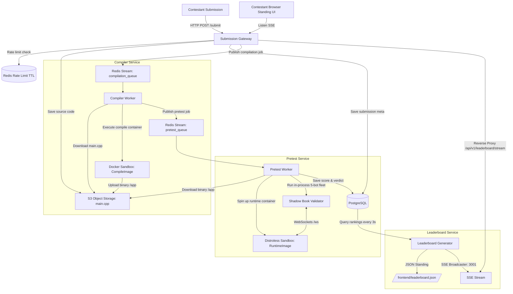

# IICPC-2026-BenchGrid: Distributed Benchmarking and Hosting Platform

An event-driven, microservice-based distributed evaluation platform designed to compile, isolate, benchmark, and score contestant-submitted C++ matching engines under high concurrency. Built to scale to 100K concurrent viewers, 5K submitters, and 50K leaderboard contestants, the platform models a real-time trading competition environment with robust security controls and high-precision telemetry.

---

## 1. System Architecture

The platform uses a completely decoupled, event-driven, and highly resilient microservices pipeline connected via **Redis Streams**, backed by **PostgreSQL**, **S3-compatible Object Storage (MinIO)**, and **Apache Kafka (Redpanda)**.



### Microservices Decomposition

* **Submission Gateway** (`services/gateway/`): Stateless Fiber web server handling submission uploads, performing Redis-based rate limiting (1 submission per user/minute), persisting metadata in Postgres, saving source code payloads to MinIO, and dispatching jobs to the `compilation_queue` Redis Stream. It also exposes a lazy-loading source code API and acts as a reverse proxy for the Leaderboard SSE stream via standard Go `httputil.ReverseProxy`.
* **Compiler Service** (`services/compiler/`): An event loop polling the `compilation_queue` stream. Downloads source code from MinIO, compiles it inside an ephemeral compiler sandbox container (`CompileImage` based on Debian Bookworm), and uploads the compiled binary executable back to MinIO.
* **Pretest Service** (`services/pretest/`): An event loop polling the `pretest_queue` stream. Downloads compiled binaries from MinIO, executes them inside a stripped runtime container sandbox (`RuntimeImage` based on Google Distroless) under strict resource limitations, seccomp filters, and NetworkPolicies. Evaluates correctness and basic performance using an in-process 5-bot fleet (100 orders each, fixed seed) over a WebSocket connection. Logs results to PostgreSQL.
* **Leaderboard Generator** (`services/leaderboard/`): Periodically queries PostgreSQL to calculate compound scores and ranks, materializing rankings to a global static file (`frontend/leaderboard.json`) every 3 seconds to support 100K pollers. Simultaneously runs an internal SSE broadcaster on port `3001` streaming real-time standing updates.
* **Developer Diagnostics Dashboard**: An interactive UI served directly at `http://localhost:3000/dashboard` showing HTTP request rates, active compiler/pretest queue depths, database/broker metrics, and detailed submission traces with code inspection drawer.

---

## 2. Secure Sandboxing & Network Model

Contestant C++ matching engines are treated as untrusted user code. To prevent host compromise, network egress abuse, or platform spoofing, a multi-layer isolation envelope is enforced.

```
       +-----------------------------------------------+
       |                   Host OS                     |
       |  +-----------------------------------------+  |
       |  |     Google Distroless (cc-debian12)     |  |
       |  |  +-----------------------------------+  |  |
       |  |  |       Contestant Container        |  |  |
       |  |  |  [cgroups: 1 CPU, 256MB RAM]      |  |  |
       |  |  |  [NetworkPolicy: Egress Deny]     |  |  |
       |  |  |  [seccomp: blocked fork/vfork]    |  |  |
       |  |  |  [stripped: zero sh/bash/curl]    |  |  |
       |  |  |                                   |  |  |
       |  |  |  Bind: Port 8080 (WS Engine)      |  |  |
       |  |  +-----------------------------------+  |  |
       |  +-------------------|---------------------+  |
       |                      | (Dynamic Host Port Mapped)
       |                      v
       |           ws://127.0.0.1:{random}
       +-----------------------------------------------+
```

1. **Sandbox Image Separation**:
   - **Compilation Stage**: Uses `iicpc-sandbox:v1` (Debian Bookworm) including `g++`, `build-essential`, and headers (`iicpc_engine.hpp`, `hidden_server.cpp`) to build contestant binaries.
   - **Runtime Stage**: Uses `iicpc-runtime-sandbox:v1` based on Google's `gcr.io/distroless/cc-debian12`. Distroless contains **zero** shells (`/bin/sh`, `/bin/bash`), package managers, or networking commands. Even if `execve` remains open for OCI startup compatibility, dynamic process chaining is impossible.
2. **Resource Constraints (cgroups)**: Ephemeral sandbox containers are limited to **1 CPU Core** and **256MB memory** limits to prevent memory exhaustion and infinite loops.
3. **Capabilities & System Calls (Seccomp)**: Enforces a custom `seccomp.json` filter dropping all Linux capabilities (`CapDrop: ["ALL"]`) and explicitly blocking system calls related to process creation (`fork`, `vfork`) and filesystem mutations.
4. **Kubernetes NetworkPolicy**:
   - applied to the sandbox namespaces.
   - **Egress**: Deny All (`egress: []`) to prevent sandbox executions from initiating connections to external web servers, cloud provider metadata endpoints, or other internal microservices.
   - **Ingress**: Restrict inbound network traffic specifically to TCP port `8080` (WebSocket connection port) originating from the `bot-fleet` namespace.
5. **Dynamic Port Mapping (`HostPort: "0"`)**: Containers execute on the private isolated `sandbox-net` bridge network. To allow the host pretest worker to talk to the engine without breaking seccomp, the container exposes port `8080` (where the matching engine listens) and binds it to `0.0.0.0` with port `0`. Docker allocates a random high port on the host, preventing collisions and allowing concurrent runner tasks.

---

## 3. Telemetry & Scoring Engine

The platform operates two grading phases: **Pretests** (instant feedback during contest) and **System Tests** (automated post-contest distributed evaluation).

```
                       +-------------------+
                       | Composite Score   |
                       |  (Max: 100 pts)   |
                       +---------|---------+
                                 |
         +-----------------------+-----------------------+
         |                       |                       |
 +-------v-------+       +-------v-------+       +-------v-------+
 |  Correctness  |       |   Throughput  |       |    Latency    |
 |   (40% wt)    |       |   (30% wt)    |       |   (30% wt)    |
 |               |       |               |       |               |
 | Shadow Book   |       | min(TPS/      |       | P99 <= 500us  |
 | Validation    |       |  Target, 1.0) |       | -> 100 pts    |
 | (0-100 score) |       |  * 100        |       | Decays to 0   |
 |               |       |               |       |  at P99 = 5ms |
 +---------------+       +---------------+       +---------------+
```

### Composite Scoring Formula
$$\text{Composite Score} = (\text{Correctness Score} \times 0.4) + (\text{Throughput Score} \times 0.3) + (\text{Latency Score} \times 0.3)$$

* **Correctness Score**: Calculated by an in-process Shadow Book validator that mimics the orders dispatched to the contestant engine, verifying fills, quantities, execution prices, counterparty order IDs, and priority rules.
* **Throughput Score**: Measured based on successful transactions per second against target thresholds:
  $$\text{Throughput Score} = \min\left(\frac{\text{Actual TPS}}{\text{Target TPS}}, 1.0\right) \times 100$$
* **Latency Score**: Evaluated using High-Dynamic Range (HDR) Histograms (`HdrHistogram`). Maximum score is achieved if P99 latency remains under 500 microseconds, decaying linearly to 0 at 5 milliseconds.

### Post-Contest High-Load System Tests
During post-contest system tests, the platform scales the workload to a distributed bot fleet managed via gRPC (Master-Worker layout). Bots dispatch randomized trading strategies (aggressive liquidity takers, market makers, momentum traders) while streaming transaction telemetry into **Apache Kafka (Redpanda)**. The validator consumes the Kafka stream to analyze state correctness and order delays at high volumes (up to 400K orders).

---

## 4. Problems Faced & Resolutions

### Issue 1: Container Startup Failure (`SIGSYS` / Exit Code 159)
* **Problem**: During early pretest runs, containers exited immediately with status code `159`. This was traced to `SIGSYS` (Bad System Call), triggered when the OCI runtime (`runc`) or glibc attempted namespace adjustments in host-network mode under our strict seccomp profile, which blocks namespace and process execution syscalls.
* **Resolution**: Replaced host networking with the bridge `sandbox-net` network and implemented **Dynamic Port Mapping**. By binding `8080/tcp` to `0.0.0.0:0`, Docker automatically allocates a free host port, allowing loopback websocket connectivity. We split sandboxing into `CompileImage` and `RuntimeImage` and moved the execution sandbox to a stripped Google Distroless environment to allow `execve` safety.

### Issue 2: Order Book State Desynchronization (Cancel ACK Race)
* **Problem**: Under heavy concurrent bot loads, the Shadow Book validator recorded mismatches for correct contestant engines. Trace analysis showed a race condition: a bot sending a limit order followed instantly by a cancel order caused the cancel request to overwrite the limit order inside the `pendingOrders` map before the limit order's `"accepted"` ACK arrived.
* **Resolution**: Refactored `ProcessOrder` to ignore `CANCEL` requests for `pendingOrders` tracking. Cancel requests are direct book mutations and do not represent new in-flight order placements. The validator now removes resting orders from the active book immediately upon receiving the `"cancelled"` ACK, eliminating map collisions.

### Issue 3: Kafka/Redpanda Metadata Delay (`UNKNOWN_TOPIC_OR_PARTITION`)
* **Problem**: Post-contest system test workers crashed during bootstrap, complaining that the Kafka topic `order-events` was missing or metadata had not propagated, even though the Docker compose stack had just started.
* **Resolution**: Added a health-check hook in the startup scripts (`scripts/run_systest.sh`) that calls `rpk topic create order-events -p 6` directly inside the Redpanda container during startup, pre-creating the topic and partitions before workers initialization.

---

## 5. Directory Layout

```
.
├── bot-fleet/                  # Distributed load generator (gRPC master/workers & Kafka producer/consumer)
│   ├── shadow/                 # Red-black tree shadow book validator
│   ├── telemetry/              # Kafka event producers and consumers
│   └── strategy.go             # Bot trading strategies (Market Maker, Momentum, etc.)
├── core/                       # Shared C++ headers and base matching engine interface definitions
├── frontend/                   # Leaderboard landing page static assets
├── k8s/                        # Kubernetes deployment files
│   └── hpa/                    # HPA configurations for compile and pretest queue scaling
├── migrations/                 # Postgres database schema migrations (Goose SQL format)
├── scripts/                    # Automation scripts for testing and orchestration
├── services/                   # Go-based microservices
│   ├── common/                 # Shared helpers for Docker client connections, S3 pools, and Seccomp definitions
│   ├── gateway/                # submission entry, rate limits, dashboard UI, and REST endpoints
│   ├── compiler/               # compilation worker polling Redis compilation_queue
│   ├── pretest/                # secure sandbox orchestrator and pretest evaluator
│   └── leaderboard/            # standings SSE generator
├── test_payloads/              # Mock C++ matching engine payloads (incorrect, optimized, slow, crashing)
└── tests/                      # Go E2E platform lifecycle testing suite
```

---

## 6. Setup & Execution Guide

### Prerequisites
* **Docker** & **Docker Compose**
* **Go 1.26.3+**
* **PostgreSQL** & **Redis** (provided via Docker Compose)

### 1. Launching Local Infrastructure
Start Postgres, Redis, and MinIO in the background:
```bash
docker compose up -d
```

### 2. running Database Migrations
Database schema migrations are run automatically using Goose CLI in Docker Compose via `iicpc-init-db`.
To view migration status or run them in production:
```bash
# In Kubernetes:
kubectl apply -f k8s/migration-job.yaml
```

### 3. Running Dev Platform Services
To start all Go microservices locally in development and keep them active for frontend testing/dashboard inspection:
```bash
./scripts/start_dev_services.sh
```

### 4. Local Smoke Test Verification
Runs the local smoke pipeline, compiles the matching engine, runs pretest validations, and outputs scores:
```bash
./scripts/local_smoke.sh
```

### 5. Running the End-to-End (E2E) Test Suite
Orchestrates background services, executes Go integration tests verifying database states, static standings compilation, and scrubs metadata on teardown:
```bash
./scripts/run_e2e_tests.sh
```

### 6. Running High-Load Post-Contest System Tests
Spins up Redpanda, configures topics, initializes the distributed bot fleet worker nodes, sends high-volume orders, and prints Kafka trace latency histograms:
```bash
./scripts/run_systest.sh
```

### 7. Accessing the Developer Diagnostics Dashboard
Open your browser and navigate to:
```
http://localhost:3000/dashboard
```
Here you can trigger mock submissions, monitor system performance metrics, view processing latency, and inspect source codes in real-time.

---

## 7. Future Upgrades

* **Real-time Leaderboard & Charts**: Switch from 3-second polling to instant WebSockets/SSE updates and add interactive charts for comparing contestant performance.
* **Faster Autoscaling**: Scale compilation and pretest workers under 10 seconds based directly on Redis queue lengths.
* **Rust & Go Support**: Extend the compiler sandbox to support Rust and Go matching engines besides C++.
* **Visual Performance Profiling**: Add interactive flame graphs and lock analysis tools to the developer dashboard.
