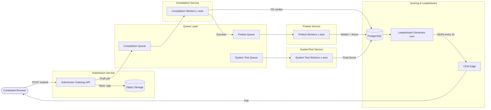
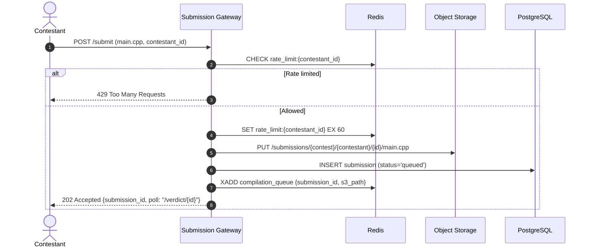
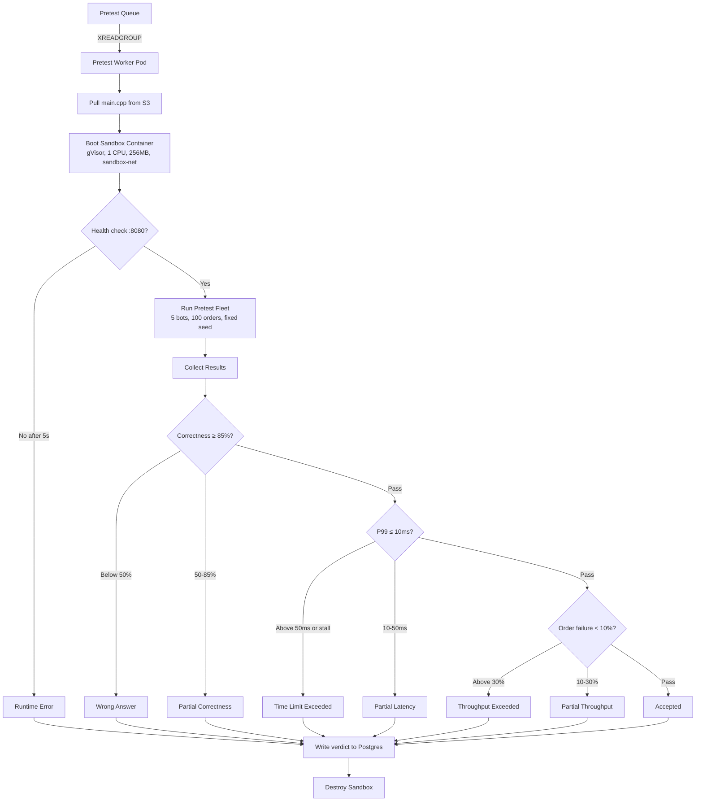
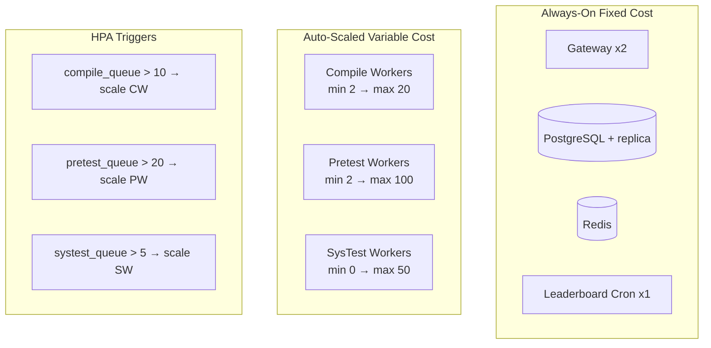

# IICPC 2026: Scaled Platform Design
## Final Brainstormed Architecture — Event-Driven Pipeline at 100K Scale

---

## Understanding Summary

- **What**: A Codeforces-style distributed benchmarking platform for evaluating contestant-submitted C++ matching engines
- **Who**: ~100K concurrent viewers, 1K–5K concurrent submitters, 50K contestants on leaderboard
- **Contest Flow**: Fast pretests (~5s) during contest give instant graduated verdicts; full system tests run post-contest to finalize rankings
- **Verdicts**: Graduated severity across 3 axes (Correctness, Latency, Throughput) + infrastructure failures (CE, RE)
- **Architecture**: 6 independent services connected via Redis Streams queues
- **Execution Scaling**: Auto-scaling sandbox pool (10 baseline → 100 at peak) on Kubernetes HPA
- **Leaderboard**: CDN-served static JSON regenerated every 3 seconds, handles 100K viewers at near-zero marginal cost
- **Rate Limit**: 1 submission per minute per contestant via Redis TTL
- **Post-contest failures**: Reduced score, not disqualification

## Assumptions

- Pretest suite is small and deterministic (fixed seed, 5 bots, 100 orders, ~3s runtime)
- System tests are heavyweight (50+ bots, 10K+ orders, multi-strategy, ~30–120s runtime)
- Contestants cannot see system test parameters, only pretest verdicts during contest
- Post-contest re-judging is batch, non-interactive, can take hours
- Cloud target: Kubernetes on AWS/GCP with autoscaling node groups
- Queue technology: Redis Streams (simpler than Kafka for this use case)
- Spot/preemptible instances for workers to reduce cost by ~70%

---

## 1. Service Decomposition



| Service | Owns | Scales On |
|:---|:---|:---|
| Submission Gateway | Rate limiting, file storage, queue push | HTTP request rate |
| Compilation Workers | g++ execution in resource-limited containers | Queue depth |
| Pretest Workers | Sandbox boot → small bot fleet → verdict | Queue depth |
| System Test Workers | Full stress test (post-contest only) | Admin-triggered batch |
| Scoring DB (Postgres) | All verdicts, scores, contestant state | Read replicas |
| Leaderboard Generator | Periodic JSON materialization → CDN | Fixed (single cron) |

---

## 2. Submission Flow & Rate Limiting



**Design choices**:
- Rate limit via Redis TTL: atomic, O(1), survives gateway restarts
- Source stored in S3/MinIO: keeps Postgres lean for queries
- Submission ID returned immediately: contestant polls for updates
- Redis Streams as queue: ordering + persistence + consumer groups

---

## 3. Pretest Execution & Verdict Engine



### Verdict Reference

| Verdict | Axis | Trigger | Feedback Example |
|:---|:---|:---|:---|
| Compilation Error | Infra | g++ failed | Show stderr |
| Runtime Error | Infra | Engine crashed or failed health check | "Engine failed to start within 5s" |
| Wrong Answer | Correctness | Score < 50% | "12 phantom fills, 3 priority violations" |
| Partial — Correctness | Correctness | Score 50–85% | "Mostly correct, wrong counterparty on 4 orders" |
| Time Limit Exceeded | Latency | P99 > 50ms or engine stall > 2s | "Engine stalled — likely lock contention" |
| Partial — Latency | Latency | P99 between 10–50ms | "P99 = 34ms. Consider cache-friendly structures" |
| Throughput Exceeded | Throughput | >30% failure or >60% TPS degradation | "Started at 5K TPS, dropped to 800 TPS" |
| Partial — Throughput | Throughput | 10–30% failure or 30–60% degradation | "15% of orders timed out" |
| Accepted | All | All axes pass | ✓ |

### Pretest design choices:
- **Fixed seed**: deterministic, reproducible verdicts
- **5 bots × 100 orders**: completes in 1–3 seconds, total ~5s with container boot
- **No Kafka**: in-process shadow validator, zero infrastructure dependency
- **Diagnostics JSON column**: `{"phantom_fills": 3, "p99_us": 34200, "tps_degradation_pct": 15}`

---

## 4. Post-Contest System Tests & Scoring

### How system tests differ from pretests

| | Pretest | System Test |
|:---|:---|:---|
| Bots | 5 | 50–200 |
| Orders per bot | 100 | 500–2,000 |
| Total orders | 500 | 25K–400K |
| Strategies | Fixed ratio, fixed seed | Mixed strategies, different seed |
| Duration | ~3–5 seconds | ~30–120 seconds |
| Kafka telemetry | No (in-process) | Yes (async pipeline) |
| Concurrency stress | 5 WS connections | 50–200 simultaneous |
| Worker pool | Auto-scaled (10–100) | Controlled batch (10–50) |

### Scoring formula

```
composite_score = (throughput_score × 0.3) + (latency_score × 0.3) + (correctness_score × 0.4)
```

- **throughput_score** = `min(actual_tps / target_tps, 1.0) × 100`
- **latency_score** = `100 if p99 ≤ 500µs`, linear decay to `0 at p99 = 5ms`
- **correctness_score** = Shadow validator graduated score (0–100)

### Reduced-score policy
If system test score < pretest score, leaderboard uses `system_test_score`. Contestant keeps their position but rank drops naturally.

### Leaderboard query (50K contestants)

```sql
SELECT contestant_id,
       MAX(composite_score) as best_score,
       ROW_NUMBER() OVER (ORDER BY MAX(composite_score) DESC) as rank
FROM submissions
WHERE contest_id = $1 AND verdict != 'compilation_error'
GROUP BY contestant_id
ORDER BY best_score DESC;
```

Index: `(contest_id, contestant_id, composite_score)` — runs in <50ms at 50K contestants.

---

## 5. Auto-Scaling & Cost Model

### Kubernetes Layout



### Cost estimates

| State | Active Pods | Est. Cost |
|:---|:---|:---|
| Idle (no contest) | GW×2 + PG + Redis + Cron ≈ 6 | ~$50/day |
| Contest steady | + CW×5 + PW×15 | ~$200/day |
| Contest peak (surge) | + CW×20 + PW×100 | ~$800/day (minutes) |
| Post-contest systests | + SW×50 (batch) | ~$300 one-time |

### Scaling rules
- **Scale-up**: 30 seconds. Pre-pulled container images on warm nodes.
- **Scale-down**: 5 minute cooldown to prevent thrashing.
- **System test workers default to 0**: admin-triggered via `/admin/rejudge`.
- **Spot instances**: Pretest and system test workers run on preemptible nodes (70% savings). Preempted jobs return to queue automatically.

---

## 6. Decision Log

| # | Decision | Alternatives | Rationale |
|:--|:---|:---|:---|
| D1 | Hybrid 100K viewers + 5K submitters, queued | All-submit, all-view | Matches real contest patterns |
| D2 | CF two-phase: pretests + post-contest systests | Continuous, tiered | Fast feedback + thorough validation |
| D3 | Graduated verdicts across 3 axes | Binary pass/fail | Diagnostic — helps contestants improve |
| D4 | Queue-decoupled via Redis Streams | In-process, full microservice | Independence without excessive complexity |
| D5 | Auto-scale 10→100 on queue depth | Fixed pool sizes | Pay for peak only during surge minutes |
| D6 | CDN + 3s polling for leaderboard | SSE fan-out, Redis pub/sub | Infinite scale, near-zero cost |
| D7 | 1 sub/min rate limit via Redis TTL | No limit, token bucket | Simple, atomic, prevents flooding |
| D8 | Failed systest = reduced score | Full disqualification | Fairer for partial correctness |
| D9 | Pretests: in-process, no Kafka | Kafka everywhere | Fewer dependencies, faster execution |
| D10 | Spot instances for workers | On-demand only | 70% savings, queue handles retries |

---

## 7. Mapping to IICPC Problem Statement Requirements

| Requirement | Our Solution |
|:---|:---|
| Submission & Sandboxing Engine | Queue-decoupled submission gateway + gVisor containers + seccomp + airgapped sandbox-net |
| Distributed Load Generator | gRPC-sharded master-worker fleet with 3 realistic trading strategies, auto-scaled workers |
| Telemetry & Validation | In-process shadow validator for pretests, Kafka pipeline for systests, HdrHistogram latency |
| Real-Time Leaderboard | CDN-served JSON, 3s refresh, supports 100K viewers and 50K contestants |
| Infrastructure as Code | Kubernetes manifests with HPA, spot node pools, Helm charts |
| Architecture Blueprint | This document |

---

> **Design finalized through structured brainstorming**  
> *All decisions validated incrementally with stakeholder*  
> *Ready for implementation handoff*
