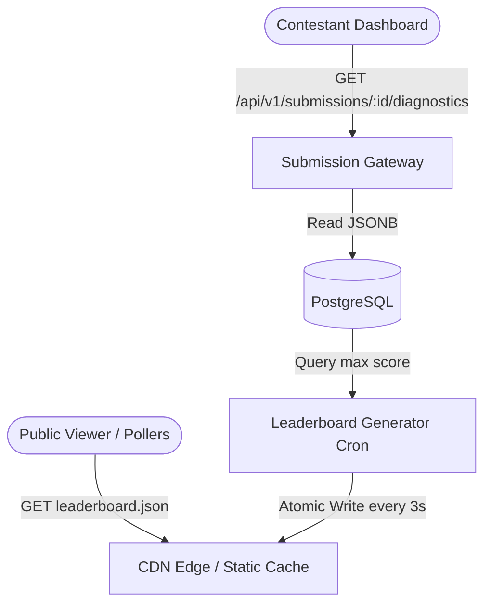

# Leaderboard and Analytics Platform Design Specification
## IICPC Summer Hackathon 2026

This document details the visual components, data models, and user experience requirements for the Real-Time Leaderboard and Analytics Platform. It is designed to evaluate contestant matching engines under stress tests, scaling to support up to 50,000 contestants and 100,000 concurrent viewers under the hybrid static/dynamic platform architecture.

---

## 1. Understanding Summary
* **What is being built:** A multi-dimensional web platform that renders:
  1. *Public Global Standings:* High-performance sortable scoreboard for all viewers.
  2. *Personal Run Analytics:* Advanced interactive troubleshooting console for individual contestants.
  3. *Comparative Analytics:* Overlaid benchmark charts mapping contestants against system targets and anonymous peer averages.
* **Why it exists:** To assess trade-offs in low-latency systems (correctness, latency percentiles, throughput stability) and give deep feedback for C++ matching engine optimization.
* **Who it is for:** 50,000 active contestants and 100,000 viewers.
* **Key Constraints:** Read requests are isolated using static CDN-hosted feeds to protect database infrastructure. Write/poll endpoints are rate-limited.

---

## 2. Platform Architecture & Data Flow



---

## 3. Data Schema Specifications

### Public Leaderboard Feed (`leaderboard.json`)
Served statically via CDN to eliminate query overhead during peak view periods:
```json
[
  {
    "rank": 1,
    "contestant_id": "contestant_rust_master",
    "submission_id": "a27e2de2-1aa9-423a-8c3f-9bc57c5bc51b",
    "verdict": "Accepted",
    "composite_score": 98.45,
    "correctness_score": 100.0,
    "p50_us": 120,
    "p90_us": 240,
    "p99_us": 450,
    "actual_tps": 4850.50,
    "updated_at": "2026-06-02T22:40:00Z"
  }
]
```

### Detailed Run Diagnostics API (`/api/v1/submissions/:id/diagnostics`)
Protected endpoint. Returns deep tracing metadata for debugging matching correctness and hardware bounds:
```json
{
  "submission_id": "a27e2de2-1aa9-423a-8c3f-9bc57c5bc51b",
  "status": "completed",
  "verdict": "Partial — Latency",
  "compiler_stdout": "",
  "compiler_stderr": "",
  "metrics": {
    "correctness": 95.0,
    "orders_sent": 10000,
    "orders_failed": 0,
    "phantom_fills": 0,
    "priority_violations": 2,
    "tps_start": 5000.00,
    "tps_end": 4200.00,
    "tps_degradation_pct": 16.00,
    "system_cpu_cores": 1,
    "system_memory_mb": 256
  }
}
```

---

## 4. UI Layout & Listing Requirements

### A. Public Standings Page
* **Visual Theme:** Premium modern dark UI (slate/gray layout background with glowing neon accent indicators).
* **Search & Filters:** Real-time text search by Contestant ID.
* **Sortable Telemetry Columns:**
  * **Rank:** Dynamic position on the leaderboard.
  * **Contestant ID:** Obfuscated or plain depending on user profile settings.
  * **Verdicts:** Colored indicators mapping the three axes of performance.
  * **Composite Score:** Weighted aggregate of correctness ($40\%$), latency ($30\%$), and throughput ($30\%$).
  * **Latency ($P99$):** Sorted ascending (fastest engines bubble up).
  * **Throughput ($TPS$):** Sorted descending (highest capacity engines bubble up).
  * **Correctness:** Mismatch-free order fulfillment rate.

### B. Personal Run Diagnostics Dashboard
* **Axis Breakdown Gauges:** Three dials representing the sub-scores.
* **Orderbook Correctness Inspector:** A tabular grid documenting order-matching anomalies generated by validators:
  * **Priority Violations:** Details price-time priority breaches (e.g. Expected Fill ID vs. Actual Fill ID).
  * **Phantom Fills:** Identifies trades executed without corresponding matching orders.
  * **Trade Discrepancies:** Marks incorrect quantities or counterparty mismatch IDs.
* **Logs Console:** Standard shell terminal layout detailing compiler warnings/errors and runtime sandbox diagnostic checks (gVisor resource constraints, exit codes).

### C. Comparative Analytics Dashboard
* **Latency Distribution Curve:** Dynamic line chart plotting the contestant's latency percentiles ($P50$, $P90$, $P99$) against:
  * *System Target SLA Limit* (e.g., $5\text{ms}$ threshold).
  * *Leaderboard Top 10% Average* (anonymous).
* **Throughput Volatility Chart:** Line chart depicting $TPS$ trends across the duration of stress tests to show performance degradation under high concurrency volumes.

---

## 5. Non-Functional & Security Assumptions
* **Latency SLA:** Global edge static file reads $< 50\text{ms}$.
* **Data Security:** Exact compilation logs, source paths, and fine-grained order violation logs are strictly visible only to the authenticated contestant who submitted the code.
* **Atomic Writes:** File writing to `leaderboard.json` is completed atomically using a temporary file rename process (`tmp-rename`) to avoid partial read corruption.

---

## 6. Brainstorming Decision Log

| # | Decision | Alternatives Considered | Rationale |
|:--|:---|:---|:---|
| **1** | **Hybrid Static/Dynamic Platform Architecture** | • *Pure Jamstack Edge*<br/>• *Real-Time Websockets* | Prevents database exhaustion by serving rankings from static files while serving deep metrics via on-demand, rate-limited APIs. |
| **2** | **Multi-Axis Visual Grading** | Binary Pass/Fail scoring. | Correctness, latency, and throughput are independent axes. Graduated verdicts tell contestants *where* their engines need optimization. |
| **3** | **Anonymous Comparative Charting** | Open public competitor charts. | Prevents IP leakage and reverse engineering of top contestants' algorithms while still showing contestants their relative performance standings. |
| **4** | **Grain-Level Correctness Inspector** | High-level scorecard only. | Since correctness holds a $40\%$ composite score weight, providing matching mismatch details (phantom fills, priority violations) is crucial for C++ debugging. |
