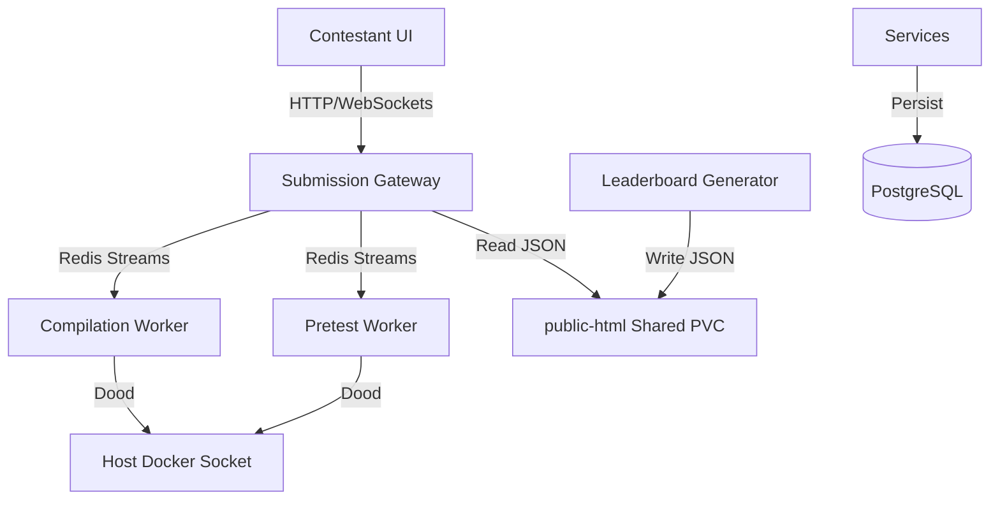

# Kubernetes Deployment and Autoscaling Manual

This document details the configuration, deployment, and autoscaling policies for the **IICPC Algorithmic Trading Hackathon Standings & Benchmarking Platform** in a Kubernetes environment.

---

## 1. System Architecture

The platform is designed as a modular, horizontally scalable set of microservices communicating via Redis Streams and persisting state in PostgreSQL:



### Shared PVC Integration
- **`public-html-pvc`** is a shared Persistent Volume Claim (`ReadWriteOnce`).
- To prevent volume mounts from overlaying and hiding static assets compiled inside the `gateway` Docker image (such as `index.html`, `style.css`, and `app.js`), we utilize separate environment-configured paths:
  - **Leaderboard Generator** writes to `/app/data/leaderboard.json` (configured via `FRONTEND_DIR=/app/data`).
  - **Submission Gateway** serves static files from its internal directory, but intercepts requests to `/leaderboard.json` and reads them from `/app/data/leaderboard.json` (configured via `LEADERBOARD_JSON_PATH=/app/data/leaderboard.json`).

---

## 2. Deployment Instructions

### Prerequisites
- Active Kubernetes cluster (e.g., Minikube, Kind, or a cloud provider like GKE/EKS).
- Local Docker daemon running.
- `kubectl` and `helm` installed.

### Automated Orchestration
To deploy the entire stack automatically, run the unified orchestration script:
```bash
./scripts/deploy_k8s.sh
```

This script will:
1. Detect cluster type (e.g., automatically loads images into `kind` or `minikube`).
2. Build the contestant sandbox image (`iicpc-sandbox:v1`).
3. Build all microservice binaries and pack them into Go-runtime scratch container images.
4. Load the images into the local Kubernetes cluster.
5. Create shared Persistent Volume Claims (PVCs) for PostgreSQL, Redis, and public HTML assets.
6. Start PostgreSQL and Redis, blocking until they report healthy.
7. Run the PostgreSQL database auto-migrations via a Kubernetes Job (`iicpc-migration-job`).
8. Deploy the microservices and gateways.
9. Deploy the Horizontal Pod Autoscalers (HPAs).

---

## 3. Horizontal Pod Autoscaling (HPA)

Autoscaling is implemented for compute-heavy worker nodes using Kubernetes native Horizontal Pod Autoscalers:

### Policies
- **`compilation-worker`**: Auto-scales based on CPU usage limit.
  - Min Replicas: `2`
  - Max Replicas: `10`
  - Target CPU Utilization: `85%`
- **`pretest-worker`**: Auto-scales based on memory usage limit to accommodate parallel C++ sandboxed executions.
  - Min Replicas: `2`
  - Max Replicas: `8`
  - Target Memory Utilization: `80%`

### Verification of HPAs
Check current replica counts and target metrics using:
```bash
kubectl get hpa
```

To simulate load and verify scale-up behavior:
```bash
# Generate high concurrency test submissions using a loop
for i in {1..20}; do
  curl -X POST -F "contestant_id=loadtest-$i" -F "source_code=@test_payloads/optimized_engine.cpp" http://localhost:3000/api/v1/submit
done
```

---

## 4. Manual Verification & Troubleshooting

### Check Pod Status
```bash
kubectl get pods -l app=submission-gateway
kubectl get pods -l app=compilation-worker
kubectl get pods -l app=pretest-worker
```

### Accessing the Dashboard UI
To access the Contestant UI dashboard from your local browser, port-forward the Gateway service:
```bash
kubectl port-forward service/submission-gateway 3000:3000
```
Then visit `http://localhost:3000` in your web browser.

### Inspecting Logs
```bash
# Stream Submission Gateway logs
kubectl logs -f deployment/submission-gateway

# Stream Pretest Worker logs
kubectl logs -f deployment/pretest-worker
```
